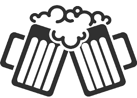

# Project
<div style="display: flex; flex-direction: row; align-items:center; justify-content: start" >
    
    
</div>
<br>

[Splashd](https://splashd.onrender.com/) is a web application based of Untapped, and created by a team of 4 software engineers.

<br>

## Project Wiki
* [Database Schema](https://github.com/D0RK5TER/Splashd/wiki/Database-Schema)
* [Features List](https://github.com/D0RK5TER/Splashd/wiki/Features-List)
* [Redux Store Shape](https://github.com/D0RK5TER/Splashd/wiki/Redux-Store-Shape)
* [User Stories](https://github.com/D0RK5TER/Splashd/wiki/User-Stories)


## Built Using
### Frontend


### Backend


### Host


# The Splash Page!


# Once you enter the site, you should probably log in!


# Earn Badges by checking in beers!


# Getting Started
1. Clone the repo:
```
https://github.com/D0RK5TER/Splashd
```

2. Install packages:
```
pipenv install
cd react-app
npm install
```

3. Create .env and add:
```
SECRET_KEY=<<Password of your choosing>>
DATABASE_URL=sqlite:///dev.db
```

4. Enter the shell, then Migrate and seed files:
```
pipenv shell
flask db init
flask db migrate
flask db upgrade
flask seed all
```

5. Run the server
```
flask run
cd react-app
npm start
```

6. Navigate to local site
```
http://localhost:3000/
```
